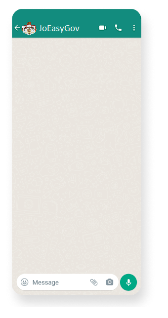
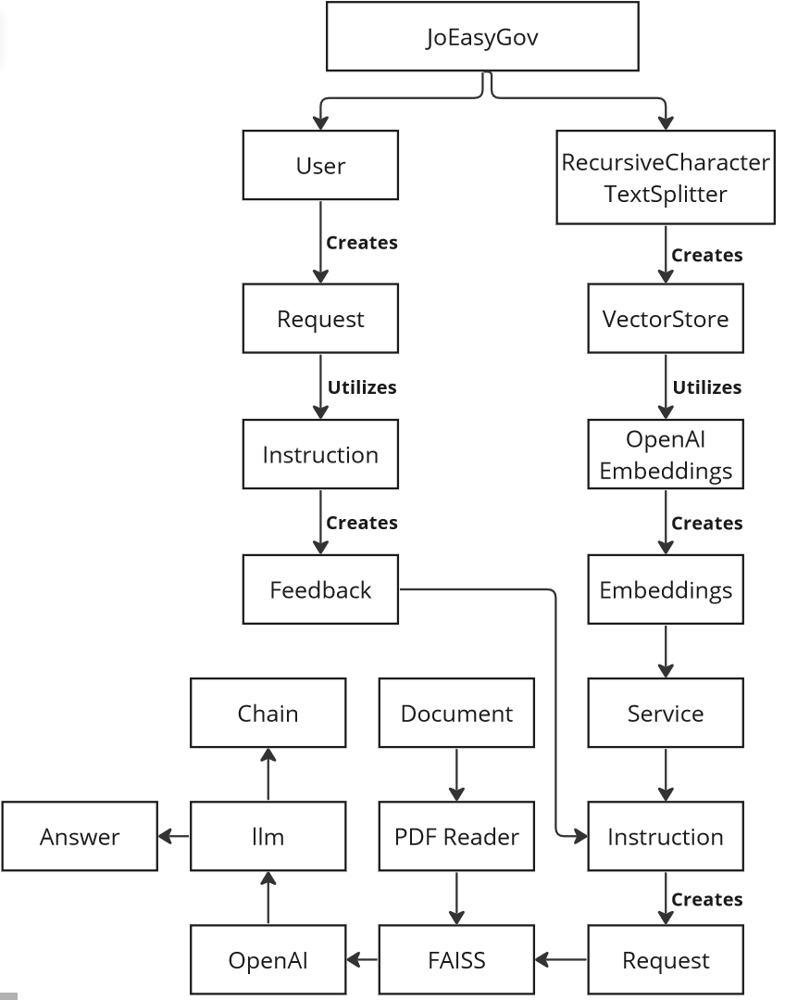

# Wireframes-and-Software-Requirements
# Wireframes
the wireframe is simply will be the whatsapp chat which will look like this:

# User Stories
### Title : Story one

- User Story sentence:
As a user, I want to reach the instructions for renewal my Passport so that I can quickly navigate to my account and do it .
- Feature Tasks : to scrape the Civil affairs at https://eservices.cspd.gov.jo/index-rtl.html
- Acceptance Tests : to return the correct information

### Title : Story two

- User Story sentence:
As a user, I want to reach the instructions for Renewal of Driver's License so that I can quickly navigate to my account and do it .
- Feature Tasks : to scrape this web site (https://www.ammancity.gov.jo/ar/eservices/login.aspx)
- Acceptance Tests : to return the correct information

### Title : Story Three

- User Story sentence:
As a user, I want to reach the E-Services that Civil Status and passports Department provided using voice Record so that I can quickly have the reponse.
- Feature Tasks : to reach the bot on the whatssaap platform 
- Acceptance Tests : to return the correct instructions

### Title : Story Four

- User Story sentence:
As a user, I want to reach the instructions to create a new Id  using voice Record so I can prepare them before  .
- Feature Tasks : send a voice note to the whatsaap, the function will convert the voive to text and do what the user wants 
- Acceptance Tests :  to return the correct instructions

### Title : Story Five

- User Story sentence:
As a user, I want to ..... using voice Record .
- Feature Tasks : send a voice note to the whatsaap, the function will convert the voive to text and do what the user wants 
- Acceptance Tests :  to return the correct instructions

### Estimate your User Stories

- extra small : 0-2 hours
- extra large : day or two

| story #       | estimation time |
|:-------------:|:---------------:|
|1|extra large|
|2|extra large|
|3|extra large|
|4|extra large|
|5|extra small|

# Domain Modeling

### Entities:

1. PdfReader: Represents a PDF reader object.
2. RecursiveCharacterTextSplitter: Represents a text splitter object that divides the text into chunks.
3. VectorStore: Represents a vector store for embeddings.
4. OpenAIEmbeddings: Represents embeddings generated using OpenAI.
5. FAISS: Represents a vector store implementation using FAISS.
6. llm: Represents an instance of the OpenAI language model.
7. Chain: Represents a question-answering chain.

### Relationships:

- PdfReader is associated with the uploaded PDF file.
- RecursiveCharacterTextSplitter splits the text extracted from the PDF into chunks.
- VectorStore is created from the chunks of text.
- OpenAIEmbeddings generates embeddings for the chunks of text.
- FAISS utilizes the embeddings to create the VectorStore.
- llm is an instance of the OpenAI language model used for question-answering.
- Chain is created using the llm instance for question-answering.

### Domain Model Diagram

1. Request: Represents a user's request for a particular government service. It may have properties like request ID, user ID, and service ID.
2. Service: Represents a government service
3. Instruction: Represents the instructions provided to the user for completing a task related to a government service. like instruction ID, service ID, step description, and additional resources.
4. Feedback: Represents the user follow up information
